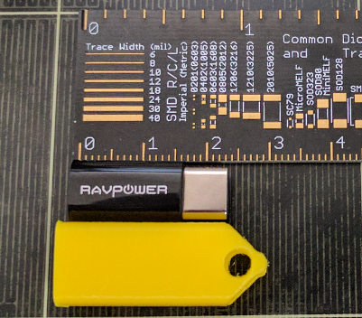

# Type C to Micro Keychain Holder

A keychain thing (charm?) to hold a tiny type C to micro adapter. Held in by a standard keyring. Capable of withstanding moderate forces (tested with a static load of 10lbs / 4.54kg) on the keyring end (Prusa/Fillamenium filament, 0.15mm Prusa3D layer setting/temperatures).

